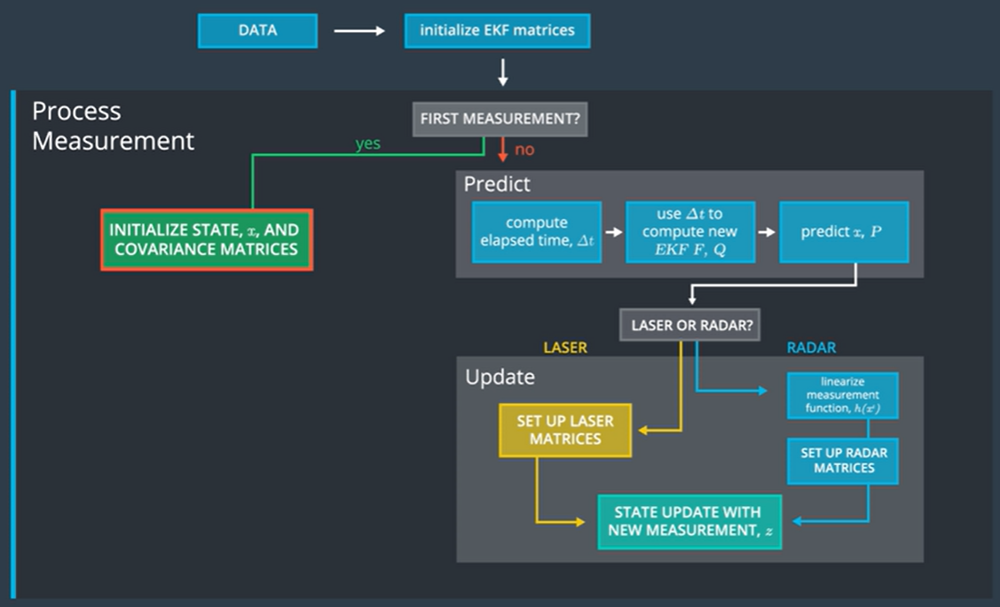

# SFND_Unscented_Kalman_Filter
Sensor Fusion UKF Highway Project Starter Code

In this project I implemented an Unscented Kalman Filter to estimate the state of multiple cars on a highway using noisy lidar and radar measurements. Passing the project requires obtaining RMSE values that are lower that the tolerance outlined in the project rubric. 

`main.cpp` is using `highway.h` to create a straight 3 lane highway environment with 3 traffic cars and the main ego car at the center. 
The viewer scene is centered around the ego car and the coordinate system is relative to the ego car as well. 
The ego car is green while the other traffic cars are blue. The traffic cars will be accelerating and altering their steering to change lanes. Each of the traffic car's has
it's own UKF object generated for it, and will update each indidual one during every time step. 

* The red spheres above cars represent the (x,y) lidar detection 
* The purple lines show the radar measurements with the velocity magnitude along the detected angle.
* The green spheres show the UKF estimation of the vehicle position

---

## Other Important Dependencies
* cmake >= 3.5
  * All OSes: [click here for installation instructions](https://cmake.org/install/)
* make >= 4.1 (Linux, Mac), 3.81 (Windows)
  * Linux: make is installed by default on most Linux distros
  * Mac: [install Xcode command line tools to get make](https://developer.apple.com/xcode/features/)
  * Windows: [Click here for installation instructions](http://gnuwin32.sourceforge.net/packages/make.htm)
* gcc/g++ >= 5.4
  * Linux: gcc / g++ is installed by default on most Linux distros
  * Mac: same deal as make - [install Xcode command line tools](https://developer.apple.com/xcode/features/)
  * Windows: recommend using [MinGW](http://www.mingw.org/)
 * PCL 1.2

## Basic Build Instructions

1. Clone this repo.
2. Make a build directory: `mkdir build && cd build`
3. Compile: `cmake .. && make`
4. Run it: `./ukf_highway`

## Project Rubric

## Rubric 01 - Compiling and Testing
the project code must compile without any errors

## Rubric 02 - Code Efficiency
I wrote code to minimize redundant calculation and loops for code efficiencies.

## Rubic 03 - Accuracy
Requirements: px, py, vx, vy output coordinates must have an RMSE <= [0.30, 0.16, 0.95, 0.70] after running for longer than 1 second.
The code meets the above requirements and it doesn't output any threshold failure warning during run time.

## Rubic 04 - Follows the Correct Algorithm
I followed the below sensor fusion pipeline to compute the position and velocity of the target vehicles.
I implemented UKF to track objects even though it shows an example of EKF.

1. First, we initialize UKF matrices to compute
2. When the first measurement arrives, we initialize state X and covariance matrix P
3. Then iterate the below procedures when new measurement arrives:
   1. Predict Stage
      1. Generate Sigma Points Xsig
      2. Generate Augmented Points Xaug
      3. From augmented points Xaug, predict sigma points Xsig_pred
      4. Predict state X and covariance matrix P
   2. Update Stage
      1. Lidar Measurements
         1. Calculate Kalman gain
         2. Update State mean and covariance matrix
      2. Radar Measurements
         1. Transform sigma points into measurement space Zsig
         2. Calculate innovation covariance matrix S
         3. Calculate cross correlation Tc
         4. Calculate Kalman gain
         5. Update State mean and covariance matrix
  